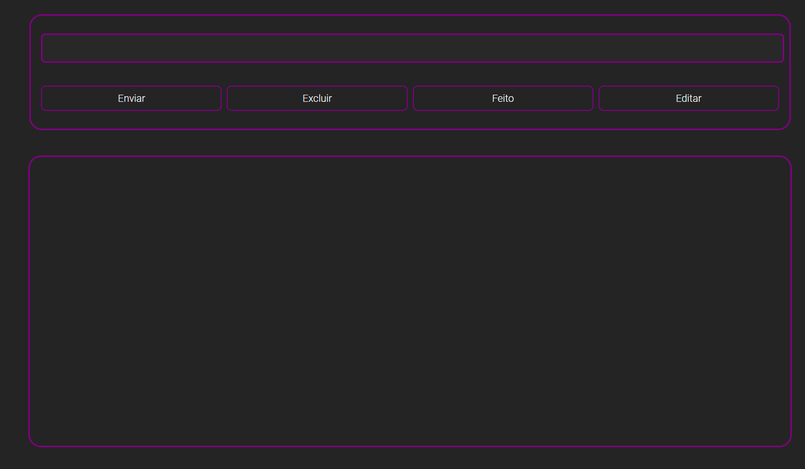

# CRUD

### Projeto feito com as coisas que aprendi no curso de Full Stack da Rocketseat



Este projeto é um CRUD (Create, Read, Update, Delete) com um diferencial: a interface inclui um checkbox que funciona como uma camada de segurança. Somente após marcar o checkbox é possível realizar ações de edição, exclusão, envio e conclusão. Abaixo do campo de entrada, há uma área central onde as operações de CRUD são efetivamente executadas, proporcionando uma experiência de uso prática e intuitiva.

## Funcionalidades

- **Criar**: Adicione novos itens à lista.
- **Ler**: Visualize os itens existentes.
- **Atualizar**: Edite informações de um item.
- **Deletar**: Remova itens da lista.
- **Concluir**: Marque itens como concluídos.

## Tecnologias Utilizadas

- HTML
- CSS
- JavaScript

## Instalação

1. Clone o repositório:
   ```bash
   git clone https://github.com/JerryTom20/osvaldo.alves.git
